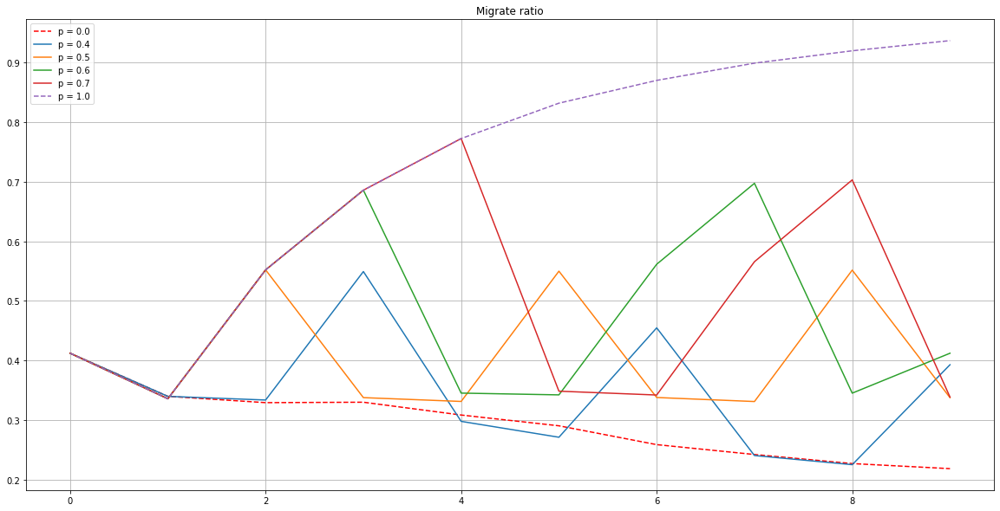

## Migrate Ratio

migrateRatio = reduce_sum(migrateCount) / universe.n_particles

if migrateRatio > p: flush

timestep = min(config.timestep_size = 0.1, max(universe.box dimensions) / reduce_max(maxVelocity) / 100)

